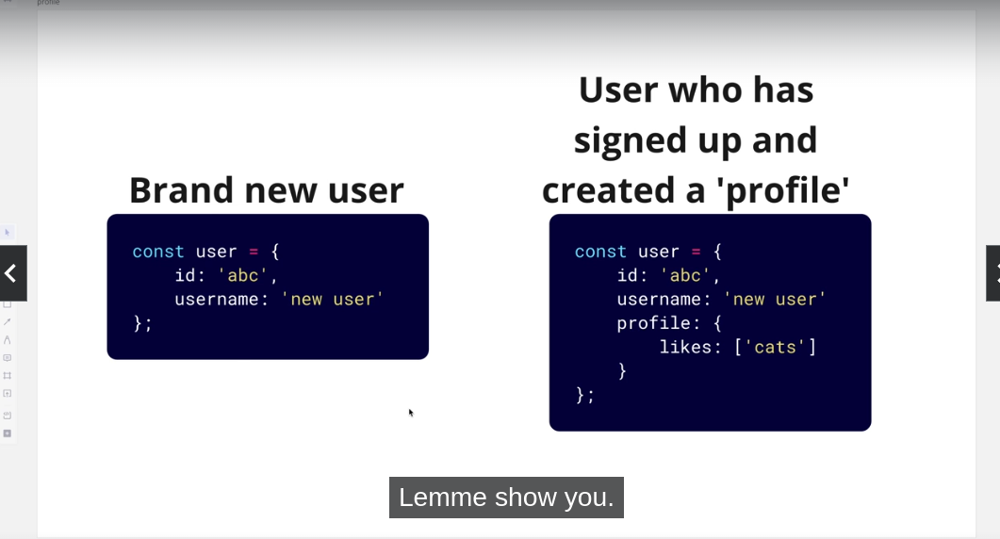
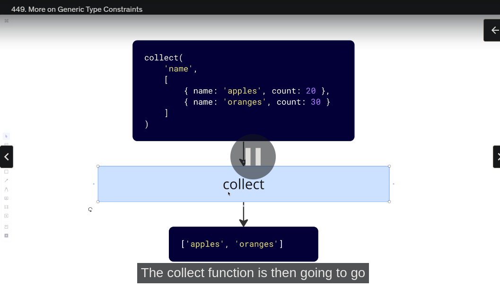

# 🟩 [417] why use typescript ?

- helps you to catch errors during development
- helps provide documentation for your components
- compiles to plain javascript
- does not improve performance

#### How to write interface

```ts
interface UserProfileProps {
  name: string;
  job: string;
  email: string;
}
```

#### to use the interface as a prop

```jsx
Function ({name , job, email} : UserProfileProps){
    return <div> </div>
}
```

# 🟩 [418] Basic Types and Type Annotations

- we can use an online playground editor for typescript

`typescriptlang.org/play`

#### Avaliable types

1. string
2. number
3. boolean
4. string[]
5. number[]
6. boolean[]

```ts
const color: string = "red"; // this is called type annotations

const colors: string[] = ["red", "green"];
```

# 🟩 [419] Function Type Annotations

##### How to add type annotations to functions

```ts
function add(a: number, b: number): number {
  return a + b;
}
```

# 🟩 [420] Type Inference (new concept)

- inference = الاستدلال

- we can leave the variable without type annotation and TS will decide the type of the variable automatically

# 🟩 [421] Describing Objects with interfaces

```ts
function formatCar(car: { year: number; model: string; make: string }) {
  return `Year : ${car.year} , model: ${car.model} , make : ${car.make}`;
}

formateCar({
  year: 2015,
  make: "Ford",
  model: "Mustang",
});
```

- defining object annotation inside function argument is so long and not good, use interfaces instead

```ts
interface Car {
  year: number;
  model: string;
  make: string;
}
```

# 🟩 [422] Using interfaces to Annotate Props

- we can build a simple react App inside TS playground

```jsx
import React from "react";

iterface TaskShowProps {
    title : string ,
    completed : boolean
}
function TaskShow({ title, completed } :TaskShowProps ) {
  return (
    <div>
      {title} - {completed ? "Done" : "Need to complete"}
    </div>
  );
}
```

# 🟩 [423] Downsides to type Inference

- at writing the object data and before sending it to the function, add type annotation to the object

```ts
const camaro : Car {
    mode : 'Camaro' ,
    year : 2010
}
```

# 🟩 [424] Function Types

- to add functions to a interface

```ts
interface Car {
   model  : string ,
   year : number  ,
   setYear : (nextYear : number) => void  , // this argument name will appear when you write code, consider it as a documentation
   setModel (nextModal : string) => void ,
   getDescription : () => string

}
```

# 🟩 [425] Function Types in props interfaces

- he just built a color picker component

# 🟩 [426] Extending an interface

```ts
interface IconButtonProps extends ButtonProps {
  icon: string;
}
```

# 🟩 [427] Type Unions

- we will make a function called `logOutput` that takes different value and based on this value it prints it in a different format

```ts
interface Image {
  src: string;
}

// Type unions
function logOutput(value: string | number | string[] | Image) {
  // ....
}

// different uses for logOutput
logOutput("hi");
logOutput(123);
logOutput(["hi", "there"]);
logOutput({ src: "img.jpg" });
```

# 🟩 [428] Type Narrowing With Type Guards

- type narrowing means that we choose the current type of a variable

```ts
function logOutput(value: string | number | string[] | Image) {
  // check types (Type Narrowing)
  if (typeof value === "string") {
    value.toUpperCase();
  }
}
```

# 🟩 [429] Tricky Cases with type Guards

🔴 if we check the type of empty array it will return object

```js
console.log(typeof [])  --->  'object'
```

- the right way to check array type

```js
Array.isArray({});
```

#### Continue type guard , type narrowing

```ts
function logOutput(value: string | number | string[] | Image) {
  // check types (Type Narrowing)
  if (typeof value === "string") {
    console.log(value.toUpperCase());
  }

  if (typeof value === "number") {
    console.log(Math.round(value));
  }

  // Narrowing types to either object or empty array
  if (typeof value === "object") {
    console.log(Math.round(value));
  }

  //  Accepting arrays only
  if (Array.isArray(value)) {
    console.log(value.join(""));
  }

  // accepting objects only
  if (typeof value === "object" && !Array.isArray(value)) {
    console.log(value.src);
  }
}
```

# 🟩 [430] Type Predicates

- Predicates = المسندات
- how can we do type narrowing if we recieve 2 objects like Car and Truck

- we can use the `in` operator to check if an object is located inside an object

```ts
function logOutput(value: Image | User) {
  if ("username" in value) {
    console.log("user object");
  }
  if ("src" in value) {
    console.log("Image object");
  }
}
```

- `Type Predicates` is a function that checks the type of object

##### Example of using type predicates

```ts
// weired syntax (value is User)
function isUser(value: Image | User) value is User {
    return "username" in value;
}

function logOutput(value: Image | User) {
  if (isUser(value)) {
    console.log("user object");
  }
  if ("src" in value) {
    console.log("Image object");
  }
}
```

# 🟩 [431] optional properties

- the goal is to make a type (interface) that include both of these 2 bojects



```ts
interface UserProfile {
  likes: string[];
}

interface User {
  id: string;
  username: string;
  profile?: UserProfile;
}
```

- just add question mark if there's an optional property that might not exist

#### To add optional property for function arguments

```ts
function logValue(value: string, message?: string) {
  if (message) {
    console.log(value, message);
  }
}
```

# 🟩 [432] Any & unknown types

- `any` : special type that tells typescript to ignore type checking around this variable

```ts
interface Book {
  title: string;
}

async function fetchBook() {
  const res = await fetch("/book");
  const data = await res.json();
  // type assertion

  return data as Book;
}
```

- `unkown` : we have to do aggressive type narrowing before assuming what a `unknown` variable's real type is

```ts
interface Book {
  title: string;
}

async function fetchBook(): Promise<Book> {
  const res = await fetch("/book");
  const data: unkown = await res.json();

  // add some type guards
  if(book && type of book === 'object' && 'title' in data && typeof data.title === 'string') {
    return data as book;
  }

  throw new Error ('Expected to get a book, but did not')
}
```

# 🟩 [433] Type Aliases

- instead of using type union (doing or operation), we can use type aliasing

```ts
type loggableValue = string | number | string[] | Image;

function logValue(value: loggableValue) {}
```

- another way to use the `type` keyword

```ts
type Image = {
  src: string;
};
```

- type can't be extended unlike interface

# 🟩 [434] Life without generics

- Generics : it makes it easier to write functions, interfaces, and more that work with multiple different types

#### Writing Awkward Code without generics

```js
function wrapInArray(value: string): string[] {
  return [value];
}

const result = wrapInArray("Hello");
/* and if we wanted to use the same function to wrap a number it 
 won't work becuase the input must be a string , and to fix this 
 
 option 1 : use type union 
 option 2 : make a second identical function 
 option 3 : use generics 
 
 */
```

# 🟩 [435] introduction to function generics

- so generics is that a tag to identify the coming parameter type

```js
function wrapInArray<TypeToWrap>(value: TypeToWrap): TypeToWrap[] {
  return [value];
}
// and in order to use the function
const result = wrapInArray < Number > 1;
```

##### Writing the same wrapInArray Function with generics

```js
function wrapInArray<TypeToWrap>(value: TypeToWrap): TypeToWrap[] {
  return [value];
}

// we can use it with string & numbers
const result = wrapInArray < String > "hello";
const result2 = wrapInArray < Number > 10;
```

# 🟩 [436] More on function generics

- we gonna make a very simple function called `toRecord`, it will take an id
  & email and return an object containing these 2 properties

```js
function toRecord(id: number, value: string) {
  return {
    id,
    value,
  };
}

const result = toRecord(123, "test@gmail.com");
```

- the id may come from the database as number or string, so we need to
  handle both cases

```js
function toRecord<TypeOfId>(id: TypeOfId, value: string) {
  return {
    id,
    value,
  };
}

const result1 = toRecord < number > (123, "test@gmail.com");
const result2 = toRecord < string > ("3213", "test@gmail.com");
```

# 🟩 [437] Multiple Generic types

```ts
function toRecord<TypeOfId, typeOfValue>(id: TypeOfId, value: typeOfValue) {
  return {
    id,
    value,
  };
}

const resul  t1 = toRecord<number, string>(123, "test@gmail.com");
const result2 = toRecord<string, number[]>("3213", [1, 2, 3]);
```

- order does not matter in generics

# 🟩 [438] more generic examples

```ts
function randomElement<T>(arr: T[]) {
  const index = Math.floor(Math.random() * arr.length);
  return arr[index];
}
const result = randomElement<number>([1, 2, 3]);
const result2 = randomeElement<string>(["1", "2", "3"]);
```

# 🟩 [439] generics with fetch

- imagine we need to make 3 requests to get user data, content , user image

```ts
interface User {
  username: string;
}

interface Message {
  content: string;
}

interface Image {
  url: string;
}
```

#### Implementing the task without using any generics

```ts
async function fetchUser() {
  const res = await fetch("/user");
  const json = await res.json();
  return json as User; // this is called type assertion
}

// to fetch message
async function fetchMessage() {
  const res = await fetch("/messages");
  const json = await res.json();
  return json as Message; // this is called type assertion
}

const run = async () => {
  const user = await fetchUser();
  const message = await fetchMessage();
};
```

### Instead of writing a function to fetch each resource, let's use generics

```ts
// we gonna return a promise that's going to resolve with Type T
async function fetchData<T>(path: string): Promise<t> {
  const res = await fetch(path);
  const json = await res.json();
  return json as T;
}

const user = await fetchData<User>("/user");
const message = await fetchData<Message>("/messages");
const img = await fetchData<Image>("/images");
```

# 🟩 [440] generics type inference

```ts
function wrapInArray<T>(value: T): T[] {
  return [value];
}
// and in order to use the function
const result = wrapInArray<Number>(1);
const result = wrapInArray<String>("2");

// i can delete the generic type and it's called type inference
const result = wrapInArray(1);
const result = wrapInArray("2"); // so all we need is to create a function with generics
```

# 🟩 [441] more on generic type inference

```ts
// we don't know the callback function will return ???
function callAndReturn<T>(fn: () => T): T {
  return fn();
}

const result = callAndReturn(() => 5);
```

# 🟩 [442] Issues with generic type inference

```tsx
function ColorPicker() {
  const [colors, setColors] = useState([]);
  const handleClick = () => {
    setColors([...colors, "red"]);
  };
  return <button onClick={handleClick}> Click</button>;
}

/* you will notice this error "Type String is
 not assignable to type never
 this message will appear when you create an state with 
 empty array 
 */
```

- Typescript can't find the type of useState input and
  it will set it to type=never, so we must add the type of
  generic for useState

# 🟩 [443] generic type constraints

- let's create a function that take 2 objects and smash them
  into one object

```ts
function merge<T extends object, U extends objects>(objA: T, objB: U) {
  return { ...objA, ...objB };
}
const result = merge({ id: "123" }, { color: "red" });
```

# 🟩 [444] more on generic type constraints



- we need to make sure that the first parameter
  matches the type inside the object in the 2nd argument

#### Explaning KeyOf

```ts
interface Product {
  name: string;
  count: number;
}
type ProductKeys = keyOf Product; // TS feature

const key: ProductKeys = 'name'
```

```ts
function collect<T extends keyOf U, U extends object>(key : T, arr: U[]) {
  return arr.map((ele) => {
    el[key];
  });
}

const result = collect("name", [
  { count: 1, name: "adsad" },
  { count: 2, name: "adsaddsa" },
]);
```

# 🟩 [445] typescript wrap up
